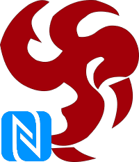

#  Shaunebu.MAUI.NFC
A Cross-Platform NFC (_Near Field Communication_) plugin to easily read and write NFC tags in your **.NET MAUI** applications.

This plugin uses **NDEF** (_NFC Data Exchange Format_) for maximum compatibilty between NFC devices, tag types, and operating systems.

## Status
|Package|NuGet
|:---|:---
|Shaunebu.MAUI.NFC | [](https://www.nuget.org/packages/Shaunebu.MAUI.NFC) 


## Supported Platforms
Platform|SDK Version|Tested on|Test Devices
:---|:---|:---|:---
Android|21+|Android 16|Google Pixel 6a, Google Pixel 9a
iOS|14.2+|iOS 18.2|iPhone 8, iPhone 16

> Windows, Mac and Linux are currently not supported. Pull Requests are very welcomed!!!!

## Setup

* Initialize the NFC plugin using `UseNfc(INfcOptions? options)` in your MauiProgram.cs:
```csharp
// Add the using to the top
using Shaunebu.MAUI.NFC.Hosting;

public static MauiApp CreateMauiApp()
{
    var builder = MauiApp.CreateBuilder();

    builder
        .UseMauiApp<App>()
        .UseNfc()
        ...

    return builder.Build();
}
```

* Customize the NFC plugin
```csharp
UseNfc(options =>
{
    // enable legacy mode for iOS (in order to read Mifare Classic 1K tags for example)
    options.LegacyMode = true;

    // customize ui messages (ex. UI messages in French)
    options.Configuration = new Configuration.NfcConfiguration
    {
        DefaultLanguageCode = "fr",
        Messages = new Configuration.UserDefinedMessages
        {
            NFCSessionInvalidated = "Session invalidée",
            NFCSessionInvalidatedButton = "OK",
            NFCWritingNotSupported = "L'écriture des TAGs NFC n'est pas supportée sur cet appareil",
            NFCDialogAlertMessage = "Approchez votre appareil du tag NFC",
            NFCErrorRead = "Erreur de lecture. Veuillez réessayer",
            NFCErrorEmptyTag = "Ce tag est vide",
            NFCErrorReadOnlyTag = "Ce tag n'est pas accessible en écriture",
            NFCErrorCapacityTag = "La capacité de ce TAG est trop basse",
            NFCErrorMissingTag = "Aucun tag trouvé",
            NFCErrorMissingTagInfo = "Aucune information à écrire sur le tag",
            NFCErrorNotSupportedTag = "Ce tag n'est pas supporté",
            NFCErrorNotCompliantTag = "Ce tag n'est pas compatible NDEF",
            NFCErrorWrite = "Aucune information à écrire sur le tag",
            NFCSuccessRead = "Lecture réussie",
            NFCSuccessWrite = "Ecriture réussie",
            NFCSuccessClear = "Effaçage réussi"
        }
    };
})
```

## Platform specifics (configuration)

### Android
* Add NFC Permission `android.permission.NFC` and NFC feature `android.hardware.nfc` in your `AndroidManifest.xml`
```xml
<uses-permission android:name="android.permission.NFC" />
<uses-feature android:name="android.hardware.nfc" android:required="false" />
```

### iOS

* Add `Near Field Communication Tag Reading` capabilty in your `Entitlements.plist`
```xml
<key>com.apple.developer.nfc.readersession.formats</key>
<array>
    <string>TAG</string>
</array>
```

* Add a NFC feature description in your Info.plist
```xml
<key>NFCReaderUsageDescription</key>
<string>NFC tag to read NDEF messages into the application</string>
```

* Add these lines in your Info.plist if you want to interact with ISO 7816 compatible tags and NDEF/Mifare Desfire EV3 compatible tags
```xml
<key>com.apple.developer.nfc.readersession.iso7816.select-identifiers</key>
<array>
    <string>com.apple.developer.nfc.readersession.iso7816.select-identifiers</string>
    <string>D2760000850100</string>
    <string>D2760000850101</string>
    <!--  Add other AID here if needed  -->
</array>
```

> For more information, list of Application Identifiers (AID) can be found on [EFTlab](https://www.eftlab.com/knowledge-base/complete-list-of-application-identifiers-aid).

#### iOS Considerations: Mifare Classik 1k and Legacy mode

The new NfcTagReaderSession API in iOS 13 no longer supports Mifare Classic 1K cards period. No idea why - but if you look at Apple's Dev Forums multiple people have spotted the same thing.

So even if you have a Mifare Classic 1K card which reads fine with the old iOS 11 NfcNdefReaderSession API, that same card will not even scan with iOS 13's NfcTagReaderSession API.

If you need to read NDEF data off of a Mifare Classic 1K card, then you set `UseNfc(options => options.LegacyMode = true)` in your `MauiProgram.cs`.

Unfortunately, even with iOS 13, it seems there is no way to read the serial number / CSN off of a Mifare Classic 1K card.

## API Usage

Before to use the plugin, please check if NFC feature is supported by the platform using `CrossNFC.IsSupported`.

### Event list to subscribe
```csharp
// Event raised when a tag is connected
public event EventHandler? OnTagConnected;

// Event raised when a tag is disconnected
public event EventHandler? OnTagDisconnected;

// Event raised when a ndef message is received.
public event NdefMessageReceivedEventHandler? OnMessageReceived;

// Event raised when a ndef message has been published.
public event NdefMessagePublishedEventHandler? OnMessagePublished;

// Event raised when a tag is discovered. Used for publishing.
public event TagDiscoveredEventHandler? OnTagDiscovered;

// Event raised when NFC listener status changed
public event TagListeningStatusChangedEventHandler? OnTagListeningStatusChanged;

// Android Only:
// Event raised when NFC state has changed.
public event OnNfcStatusChangedEventHandler OnNfcStatusChanged;

// iOS Only: 
// Event raised when a user cancelled NFC session.
public event EventHandler OniOSReadingSessionCancelled;
```

### Launch app when a compatible tag is detected on Android

In Android, you can use `IntentFilter` attribute on your `MainActivity` to initialize tag listening.
```csharp
[Activity(Theme = "@style/Maui.SplashTheme", MainLauncher = true, ConfigurationChanges = ConfigChanges.ScreenSize | ConfigChanges.Orientation | ConfigChanges.UiMode | ConfigChanges.ScreenLayout | ConfigChanges.SmallestScreenSize | ConfigChanges.Density)]
[IntentFilter(new[] { NfcAdapter.ActionNdefDiscovered }, Categories = new[] { Intent.CategoryDefault }, DataMimeType = MainPage.MIME_TYPE)]
public class MainActivity : ... 
{
    ...
}
```
To launch/open an app with a tag, `TypeFormat` of the record must be set to `NFCNdefTypeFormat.Mime` and `MimeType` should be setted to the same value of `IntentFilter.DataMimeType` (e.g. application/com.companyname.yourapp):
```csharp
var record = new NFCNdefRecord {
    TypeFormat = NFCNdefTypeFormat.Mime,
    MimeType = "application/com.companyname.yourapp",
    Payload = NFCUtils.EncodeToByteArray(_writePayload)
};
``` 

### Read a tag
* Start listening with `StartListening()`.
* When a NDEF message is received, the event `OnMessageReceived` is raised.

### Write a tag
* To write a tag, call `StartPublishing()`
* Then `PublishMessage(ITagInfo)` when `OnTagDiscovered` event is raised. 
* Do not forget to call `StopPublishing()` once the tag has been written.

### Erase/format a tag
* To erase a tag, call `StartPublishing(clearMessage: true)`.
* Then `PublishMessage(ITagInfo)` when `OnTagDiscovered` event is raised.
* Do not forget to call `StopPublishing()` once the tag has been cleared.

If the tag is `NdefFormatable`, the `StartPublishing(clearMessage: true)` method will format it.

> **For more examples, see sample applications in the repository.**
